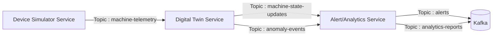

# Industrial Digital Twin & Predictive Maintenance Platform | Event-Driven Microservices Architecture with Real-Time Anomaly Detection

This project implements a backend-only, event-driven system that simulates industrial machinery, tracks their state in real-time, detects anomalies, and triggers alerts for predictive maintenance using Apache Kafka and Java + Spring Boot.

## Architecture Overview

The Industrial Equipment Digital Twin system follows a microservices architecture with event-driven communication patterns. The system consists of three main services that communicate through Apache Kafka topics.

## Services

### Device Simulator Service
- Generates realistic industrial machine sensor data
- Simulates 15 different types of industrial machines (pumps, compressors, motors, etc.)
- Publishes machine telemetry data to Kafka topics
- Configurable simulation parameters for different scenarios

### Digital Twin Service
- Consumes machine telemetry from Kafka
- Maintains real-time state representations (digital twins) for each machine
- Performs real-time anomaly detection on incoming sensor data
- Publishes state updates and anomaly events to downstream services
- Maintains historical data for analysis and replay capabilities

### Alert/Analytics Service
- Consumes anomaly events and state updates from Kafka
- Generates maintenance alerts based on detected anomalies
- Sends notifications via multiple channels (email, SMS)
- Performs analytics on machine performance and trends
- Generates maintenance reports and insights

## Kafka Configuration

The system uses Apache Kafka (Confluent Kafka 7.6.1) in KRaft mode (without Zookeeper) for high-throughput, fault-tolerant event streaming. Key features include:

- Event sourcing capabilities
- Replay functionality
- Consumer groups for scalability
- Exactly-once semantics
- Durable event storage

### Kafka Topics

The system uses the following Kafka topics for communication between services:

1. `machine-telemetry` - Raw sensor data from devices (produced by Device Simulator, consumed by Digital Twin)
2. `machine-state-updates` - Updated machine states from digital twin (produced by Digital Twin, consumed by Alert/Analytics)
3. `anomaly-events` - Detected anomalies from digital twin (produced by Digital Twin, consumed by Alert/Analytics)
4. `alerts` - Generated alerts for further processing (produced by Alert/Analytics)
5. `analytics-reports` - Analytics and performance metrics (produced by Alert/Analytics)

## Technology Stack

- **Backend Framework**: Java 21 + Spring Boot 3.x
- **Event Streaming**: Apache Kafka (Confluent KRaft mode) (NO zookeeper)
- **Database**: PostgreSQL & TimescaleDB
- **Containerization**: Docker with multi-stage builds
- **Monitoring**: Spring Boot Actuator

## Getting Started

1. Ensure Docker Desktop with WSL2 is installed (For Windows).
2. Clone the repository
3. Run `docker compose build && docker compose up -d` to start all services
4. Wait for all the services is running and healthy. Confirm with `docker ps -a`.
5. The system will simulate 15 different types of industrial machines
6. Access Kafka UI at `http://localhost:9099` to monitor topics and messages
7. Monitor the system through the exposed endpoints.
8. Test with the python scripts.

## Project Structure

- `device-simulator/` - Simulates 15 different industrial machine types
- `digital-twin/` - Maintains real-time state and detects anomalies
- `alert-analytics/` - Processes alerts and performs analytics
- `docker-compose.yml` - Orchestrates all services
- `Docs/` - Documentation files
- `scripts/` - Python scripts for automated testing.